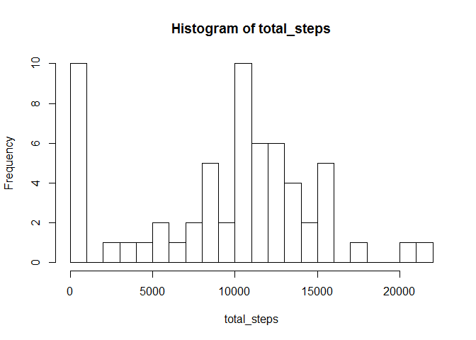
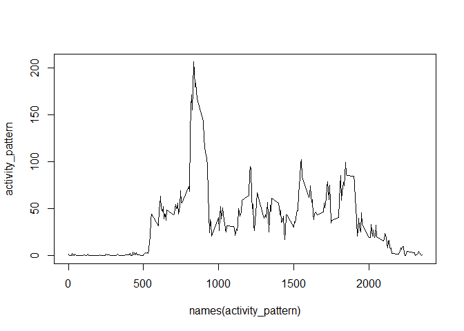
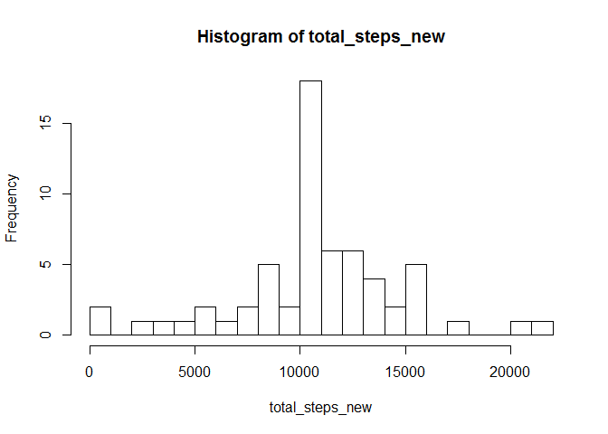

## Loading and preprocessing the data


```r
data <- as.data.frame(read.csv("activity.csv",na.strings = "NA"))
data$date = as.Date(data$date)
str(data)
```

```
## 'data.frame':	17568 obs. of  3 variables:
##  $ steps   : int  NA NA NA NA NA NA NA NA NA NA ...
##  $ date    : Date, format: "2012-10-01" "2012-10-01" ...
##  $ interval: int  0 5 10 15 20 25 30 35 40 45 ...
```

## What is mean total number of steps taken per day?


```r
total_steps <- tapply(data$steps, data$date, sum, na.rm=T)
hist(total_steps, breaks = 20)
```

<!-- -->

### What is mean and median total number of steps taken per day?

```r
total_steps_mean <- mean(total_steps, na.rm=T)
total_steps_median <- median(total_steps, na.rm=T)
```

The mean value of total steps taken per day is *9354.23* and Median value is *10395*.


## What is the average daily activity pattern?

Make a time series plot (i.e. type = "l") of the 5-minute interval (x-axis) and the average number of steps taken, 
averaged across all days (y-axis) 

```r
activity_pattern = tapply(data$steps, data$interval, mean, na.rm=T)
plot(names(activity_pattern),activity_pattern,type="l")
```

<!-- -->
  
### Which 5-minute interval, on average across all the days in the dataset, contains the maximum number of steps?  

```r
names(activity_pattern)[which.max(activity_pattern)]
```

```
## [1] "835"
```

## Imputing missing values

 * Calculate and report the total number of missing values in the dataset (i.e. the total number of rows with NAs)  

```r
na_values <- which(is.na(data$steps))
length(na_values)
```

```
## [1] 2304
```
* Devise a strategy for filling in all of the missing values in the dataset. The strategy does not need to be sophisticated. For example, you could use the mean/median for that day, or the mean for that 5-minute interval, etc.
 Create a new dataset that is equal to the original dataset but with the missing data filled in.

```r
data_new <- data
data_new[na_values,1] <- sapply(data[na_values,3], function(x) round(mean(data[data$interval==x,1],na.rm=T),0))
```
 * Make a histogram of the total number of steps taken each day and Calculate and report the mean and median total number of steps taken per day. 
 

```r
total_steps_new <- tapply(data_new$steps, data_new$date, sum, na.rm=T)
total_steps_mean_new <- mean(total_steps_new, na.rm=T)
total_steps_median_new <- median(total_steps_new, na.rm=T)
hist(total_steps_new, breaks = 20)
```

<!-- -->
  
After imputation, the mean value of total steps taken per day is *10765* and the median value is *10762*.

 * Do these values differ from the estimates from the first part of the assignment? What is the impact of imputing missing data on the estimates of the total daily number of steps?
 A: Yes, both mean and median value increased after data imputation.

## Are there differences in activity patterns between weekdays and weekends?  
 A: Yes. There are different patterns during weekdays and weekends.


```r
library(lattice)
library(dplyr)
```

```
## 
## Attaching package: 'dplyr'
```

```
## The following objects are masked from 'package:stats':
## 
##     filter, lag
```

```
## The following objects are masked from 'package:base':
## 
##     intersect, setdiff, setequal, union
```

```r
value_weekdays <- weekdays(data_new[,2])
sig_weekdays <- !(value_weekdays == 'Sunday' | value_weekdays == 'Saturday')
sig_weekdays <- factor(ifelse(sig_weekdays,"weekday","weekend"))
data_new <- cbind(data_new,sig_weekdays)
activity_pattern_new <- data_new %>% group_by(interval, sig_weekdays) %>% summarize(steps=mean(steps, na.rm=T))
xyplot(steps ~ interval | sig_weekdays, data = activity_pattern_new, type="l", xlab = 'Interval', ylab = 'Number of steps', layout = c(1,2))
```

<!-- -->

